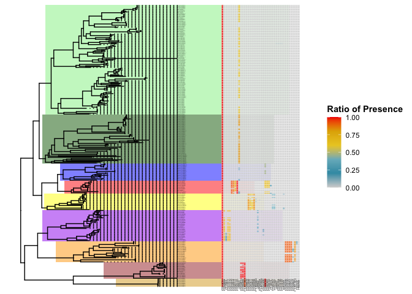
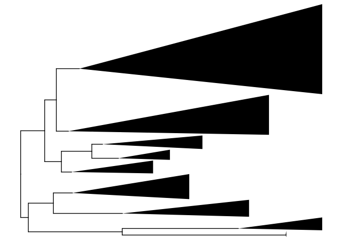

Visualising Gene Tree
================

The interproscan .tsv files results were annotated to match the
annotation of the sequence IDs in step 01

``` bash
sed -i '' '/KAK/ s/^/A_cerv_/' acrop_cerv_ipr.tsv
sed -i '' '/XP_/ s/^/A_mill_/' acrop_mill_ipr.tsv
sed -i '' '/KAJ/ s/^/D_pert_/' des_pert_ipr.tsv
sed -i '' '/XP_/ s/^/O_fave_/' orbi_fave_ipr.tsv
...
```

We visualized the tree using a heat map to see, which domains were
present in which protein sequences (look at supplementary data from the
paper for a more detailed version of the heat map)

<!-- -->

This heatmap was then divided into clades based on different domain
architecture and taxonomic exclusivity into 9 clades

<!-- -->
