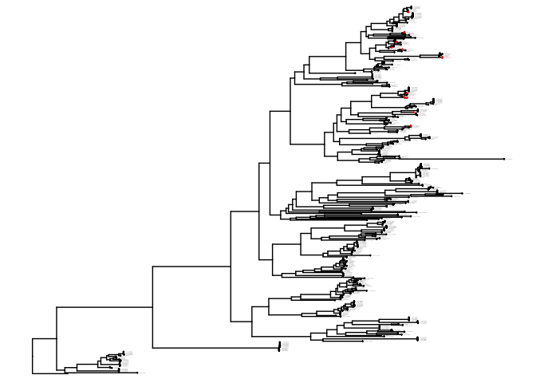
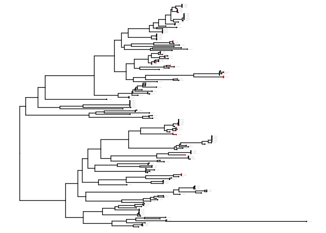

Proteins Involved in Heat-stress Responses
================

The first step is to create a BLAST database of the haem peroxidase
proteins that were used in the gene tree. This was done using the FASTA
file of compiled sequences in step 01. Its is important to note that
these sequencews are only the domain and not the whole sequence ID

``` bash
makeblastdb -in all_proteins.fasta -dbtype 'prot' -out 'ref'
```

Now each sequence involved in heat stress responses from external
studies (Table 1 in paper) was compared to the sequences in our tree
using the BLAST algorithm

``` bash
blastx -query ${external_sequence}.fasta -db ref -evalue 0.0001 -outfmt 6
```

To accompany these results all these sequences were translated from
nucleic acid sequences to amino acid sequences and the longest Open
Reading Frames (ORFs) were extracted using a custom python script

``` bash
python3 na2aa.py < fasta_file >
```

These ORFS, went rhough the same steps as in 01 and 02 to add the haem
peropxidase domains (if they were able to be extracted) into the gene
tree, giving us a gene tree which highlighted the external ORFs

    ## Joining with `by = join_by(parent, node, branch.length, label)`

<!-- -->

As is evident all the heat linked proteins are clustered at the top clad
e and further inspection rveals that they all exist in clade 1 as per
the paper. Below is a tree of only clade 1 with the heat-stress linked
proteins

<!-- -->
